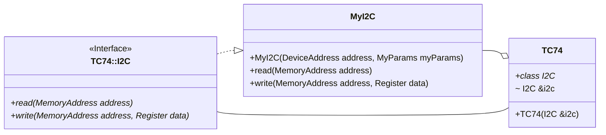

# TC74 Temperature Sensor Driver

[](LICENCE.md)
[](https://github.com/LawrenceStanton/TC74/actions/workflows/codeql.yml)
[](https://github.com/LawrenceStanton/TC74/actions/workflows/ctest.yml)

## Overview

The TC74 is a digital embedded temperature sensor. It is capable of reading temperatures from -0°C to +125°C. The TC74 communicates over I2C. This driver provides a simple C++ object oriented driver for interfacing with the TC74, and is agnostic to any embedded platform.

## How to Use

## Use as Git Submodule

1. Add this project as a `git submodule`.

    ```zsh
    git submodule add https://github.com/LawrenceStanton/TC74 Modules/TC74
    ```

2. Build with CMake by adding as a subdirectory.

    ```cmake
    # Add to Your Top-Level CMakeLists.txt
    add_subdirectory(Modules/TC74)
    # ...
    target_link_libraries(${YOUR_EXECUTABLE_NAME} PRIVATE 
        TC74
    )    
    ```

3. Provide an I2C interface when constructing the driver. Refer to [Design Patterns](#design-patterns) below and [TC74.hpp](Inc/TC74.hpp) for more information.

4. Construct the derived TC74 I2C interface and class object.

    ```cpp
    // Construct the I2C interface
    MyI2C i2cInterface(myParams);
    // Construct the HDC1080 class object
    TC74 sensor(&i2cInterface);
    ```

## Design Patterns

This driver follows a strategy design pattern with regards to the I2C interface. The driver defines a I2C interface (`TC74::I2C`). The user must then provide a concrete implementation of this interface, and provide it to the driver class via dependency injection in the constructor.



### Example

Often a concrete implementation will simply translate the I2C operations to the embedded platform's Hardware Abstraction Layer (HAL). For example, the [STM32Cube HAL](https://www.st.com/en/embedded-software/stm32cube-mcu-mpu-packages.html) provides a set of functions for reading and writing to I2C devices. The user can then implement the `TC74::I2C` interface by calling the HAL functions.```

```cpp
#include "TC74.hpp"
#include "stm32f0xx_hal.h"

using std::optional;
using std::nullopt;

class MyI2C : public TC74::I2C {
    I2C_HandleTypeDef &myParams;
    DeviceAddress i2cAddress;
public:
    MyI2C(I2C_HandleTypedef &hi2c, DeviceAddress i2cAddress) : hi2c(hi2c), i2cAddress(i2cAddress) {}

    optional<Register> read(MemoryAddress memoryAddress) noexcept override final {
        static_assert(sizeof(Register) == sizeof(uint8_t));
        uint8_t data;
        auto halStatus = HAL_I2C_Mem_Read(
            &this->hi2c, 
            static_cast<uint8_t>(this->deviceAddress) << 1,
            static_cast<uint8_t>(this->memoryAddress),
            sizeof(uint8_t),&data, sizeof(data), 100    
        );
        if(halStatus != HAL_OK) return nullopt;
        else return data;
    }

    void write(MemoryAddress address, Register data) noexcept override final {
        static_assert(sizeof(Register) == sizeof(uint8_t));
        auto status = HAL_I2C_Mem_Write(
            &this->hi2c, //
            static_cast<uint8_t>(this->deviceAddress) << 1,
            static_cast<uint8_t>(memoryAddress),
            sizeof(uint8_t), &data, sizeof(data), 100
        );
        if (status != HAL_OK) return nullopt;
        else return data;
    }
};
```

## Testing

This driver is unit tested using the [GoogleTest and GoogleMock](https://github.com/google/googletest) framework. The tests are located in the [Test](Test) directory. The tests can be built and run using CMake.

Given the limitations of many embedded systems, the tests are intended to be run on a host machine, and not the embedded platform itself. This is done by checking the CMake variable `CMAKE_CROSSCOMPILING` and only building the tests if this is false. To build the tests, simply configure CMake to perform a local build.

The tests can then be run using CTest.

```zsh
mkdir Build $$ cd Build
cmake ..
cmake --build .
ctest
```

These tests will also be included in the parent build if `enable_testing()` is called in the top-level CMakeLists.txt file.
